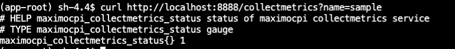

# Custom Metric Collection

!!!info
   - This page outlines how to collect custom metrics via **Maximo-CPI**. 

**Maximo-CPI** provides an API for collecting metrics in Prometheus format. It offers clients the flexibility to dynamically collect metrics for monitoring and troubleshooting. Clients can create custom scripts that output metrics in Prometheus format and utilize PodMonitor to collect these metrics through the Maximo-CPI API.

### Steps how to collect custom metrics 

- Create a custom script that outputs metrics in Prometheus format.
- Save the script in the `/opt/app-root/src/server/metricscript` directory within the Maximo-CPI pod.
- Update the script permissions to `550` using the command: `chmod 550 <custom script name>`.
- Access the Maximo-CPI pod terminal and use the following command to verify the script's output via the API:
`curl http://localhost:8888/collectmetrics?name=<custom script name>`. Below is an sample output

- Create and apply a PodMonitor. Below is a sample PodMonitor CR:
  
```yaml
apiVersion: monitoring.coreos.com/v1
kind: PodMonitor
metadata:
  name: maximocpi-status-metrics
  namespace: maximo-cpi
spec:
  namespaceSelector:
    matchNames:
      - maximo-cpi
  podMetricsEndpoints:
    - interval: 30s
      path: /collectmetrics?name=sample
      port: http
  selector:
    matchLabels:
      app: mcpi
```
- Navigate to the OpenShift Console -> Observe -> Metrics, enter <metric name> in the query field, and verify that the metric is available.

<br>

### Sample Script to Collect DB2 Workload Metric

**Note:** the script only works when running db2 pod in the openshift. Additionally, make sure to update the `namespace` and `pod name` accordingly in the script. In the below script, the namespace is be `db2u`, and the pod name is `c-db2wh-manage-db2u-0`.

Below are the steps to collect DB2 workload metrics:

- Access the Maximo-CPI pod terminal, then change the directory to `/opt/app-root/src/server/metricscript`.
- Download `db2-workload` by the command: `wget https://ibm-mas.github.io/mas-performance/pd/download/maximocpi-db/db2-workload`
- Update the permission for `db2-workload` to `550`. The command is `chmod 550 db2-workload`
- Verify the metrics via the api call. The command is `curl http://localhost:8888/collectmetrics?name=db2-workload`
- Create and apply a PodMonitor called db2-workload

```yaml
apiVersion: monitoring.coreos.com/v1
kind: PodMonitor
metadata:
  name: maximocpi-db2-workload
  namespace: maximo-cpi
spec:
  namespaceSelector:
    matchNames:
      - maximo-cpi
  podMetricsEndpoints:
    - interval: 60s
      path: /collectmetrics?name=db2-workload
      port: http
      scrapeTimeout: 60s
  selector:
    matchLabels:
      app: mcpi
```   