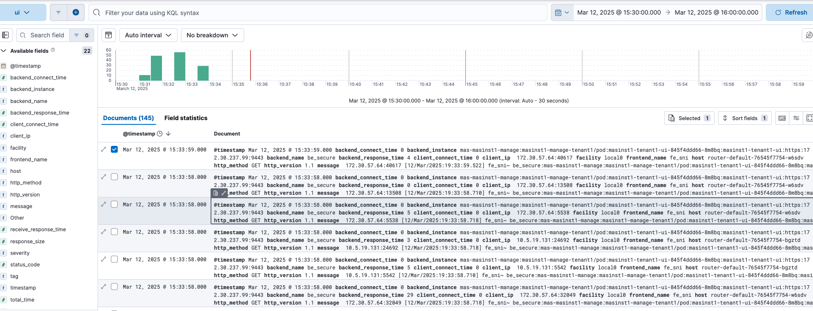

## Logging Collection


**Maximo-CPI** can be used as a **rsyslog** server. The default service port is `10514`. <br>
**Note**: Although rsyslog supports multiple input/output models, only the `omelasticsearch` module is available inside the container. <br>
It offers a few scripts that enable/disable ingressor log and manage pod log:

- `ingresslog-rsyslog.sh` to forward haproxy access log to rsyslog server. 
- `ingresslog-disable.sh` to disable the log forwarding.
- `ingresslog-container` to keep the log in the haproxy container only.
- `manage-lrquery-enable.sh <manage namespace name>` to forward the long running query. 
- `manage-lrquery-disable.sh  <manage namespace name>` to disable the log forwarding.


### Forward OpenShift Ingressor Log to Maximo-CPI

- Openshift uses haproxy as the ingressor controller. 
- Use the command `ingresslog-rsyslog.sh` to forward haproxy access log to **Maximo-CPI** pod. Use the command `ingresslog-disable.sh` to disable the log forwarding. 
- Modify `/etc/rsyslog.conf` for filtering, log location or redirection if needed. Code Snippet for the current setting:

```bash
# Provides UDP syslog reception
module(load="imudp")     
input(type="imudp" port="10514")

# Provides TCP syslog reception
module(load="imtcp")
input(type="imtcp" port="10514")

# Send local log messages to a remote server 
# module(load="omfwd")
# *.*    @logserver.example.com:514  # UDP forwarding
# *.*    @@logserver.example.com:514 # TCP forwarding

#### GLOBAL DIRECTIVES ####

# Where to place auxiliary files
global(workDirectory="/var/log/rsyslog")


# haproxy access log
$template AccessLogs,"/var/log/rsyslog/haproxy-access.log"
$template msgOnly, "%msg%\n"

# manage ui access log
if ($hostname contains "router-default-" and $msg contains "masinst1-tenant1-ui") then {
    action(type="omfile" file="/var/log/rsyslog/ui-access.log" template="msgOnly")
}

# manage long runing query log
if ($syslogtag contains "manage-lrquery") then {
    action(type="omfile" file="/var/log/rsyslog/manage-lrquery.log" template="msgOnly")
}

# catch the rest
*.* ?AccessLogs
& ~
```

### Forward Maximo Manage Long Running Query to Maximo-CPI

- Maximo Manage app will record any query over 2 seconds into the log. Use the command `manage-lrquery-enable.sh <manage namespace name>` to forward the long running query to **Maximo-CPI** pod. Use `manage-lrquery-disable.sh  <manage namespace name>` to disable the log forwarding.

### Useful commands to filter the local log

Sample message in the log looks like below:
```
10.5.19.131:5542 [12/Mar/2025:19:33:58.710] fe_sni~ be_secure:mas-masinst1-manage:masinst1-manage-tenant1/pod:masinst1-tenant1-ui-845f4ddd66-8m8bq:masinst1-tenant1-ui:https:172.30.237.99:9443 0/0/5/6/11 200 2531 - - --VN 35/13/1/1/0 0/0 "GET /maximo/webclient/javascript/dojo-20250311-1610/dojo/resources/dojo.css HTTP/1.1"
``` 

- list the urls over 2 seconds from ui-access.log: `awk '{split($0, al, " "); split(al[5], rt, "/"); if (rt[5] > 200) print $0}' ui-access.log`
- list the urls whose status code not equal 200 or 302: `awk '{split($0, al, " "); if (al[6] != 200 && al[6] != 302) print $0}' ui-access.log`
- list the urls whose resposne size over 2kb: `awk '{split($0, al, " "); if (al[7] > 2000) print $0}' ui-access.log`

### Forward the log from Rsyslog to Elasticsearch

- Modify `/etc/rsyslog.conf` to forward the log to Elasticsearch. Code Snippet:

```
template(name="plain-syslog"
  type="list"
  option.json="on") {
    constant(value="{")
      constant(value="\"@timestamp\":\"")  property(name="timereported" dateFormat="rfc3339")
      constant(value="\",\"host\":\"")     property(name="hostname")
      constant(value="\",\"severity\":\"") property(name="syslogseverity-text")
      constant(value="\",\"facility\":\"") property(name="syslogfacility-text")
      constant(value="\",\"tag\":\"")      property(name="syslogtag")
      constant(value="\",\"message\":\"")  property(name="msg")
    constant(value="\"}")
}


# manage ui access log
if ($hostname contains "router-default-" and $msg contains "masinst1-tenant1-ui") then {
    action(type="omfile" file="/var/log/rsyslog/ui-access.log" template="msgOnly")
    action(type="omelasticsearch"
           server="mas-es-internal-http.eck.svc.cluster.local:9200"       
           template="plain-syslog"
           searchIndex="ui-index"
           searchType=""
           bulkmode="on"
           queue.type="linkedlist"
           queue.size="5000"
           queue.dequeuebatchsize="300"
           usehttps="on"              
           allowunsignedcerts="on"
           skipverifyhost="on"
           uid="<elastic username>"          
           pwd="<elastic password>"          
           action.resumeRetryCount="3" 
           errorfile="/var/log/rsyslog/el-error.log"
           )
}
```

- restart the **rsyslogd** service by `supervisorctl restart rsyslogd`. 
- Create a pipeline on Elasticsearch to break down the message field if needed. Below are sample messages from Elasticsearch:

