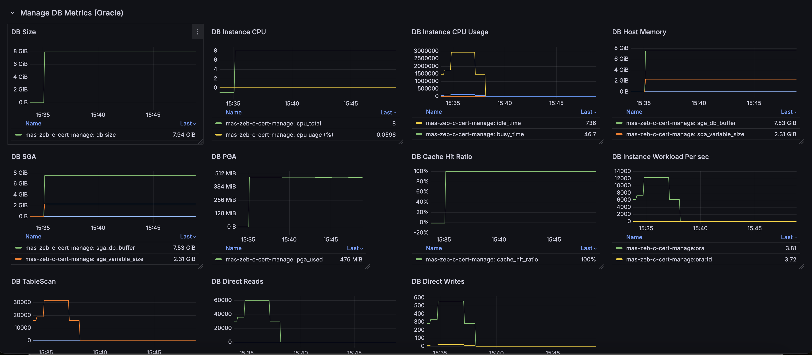

## MAS-DB Exporter

**Maximo-CPI** offers several Prometheus exporters, including the **MAS-DB Exporter**. This exporter is used to collect DB metrics e.g. cpu, memory, cache hit ratio, direct reads writes. The exporter supports DB2, Oracle and MS SQL Server.

**Warning**: This exporter leverages logging and custom metric collection features, and is only supported when **maximo-cpi** is deployed on the **OpenShift** cluster.

**Below are the scripts/command to enable and disable the exporter:**

- `mas-manage-db-exporter-enable.sh <manage namespace name> <db type>` to enable the exporter. **Note:** Valid db type values are **db2**, **ora**, **sqs**
- `mas-manage-db-exporter-disable.sh <manage namespace name>` to disable the exporter. 

**Notes:**

- The exporter supports multi-instances on the same cluster
- The enable script:
  
    -  create scripts `mas-<instance>-manage-db-exporter` under `/opt/app-root/src/server/metricscript`
    -  create and apply the podmonitor for `mas-<instance>-manage-db-exporter` in the cluster

- The disable script removes all the above scripts.
  
**Display the metrics**

- run `deploy-maximo-cpi-dashboard.sh` to import the dashboard
- Below is the dashboard snapshot sample
