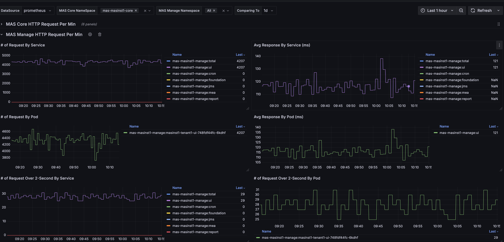

## MAS-HTTP-LRQ Exporter

**Maximo-CPI** offers several Prometheus exporters, including the **MAS-HTTP-LRQ Exporter**. This exporter is used to collect metrics related to HTTP requests, slow calls, and long-running queries for both **MAS Core** and **Manage** app.

**Warning**: This exporter leverages logging and custom metric collection features, and is only supported when **maximo-cpi** is deployed on the **OpenShift** cluster.

**Warning**: There is a known bug in the 2.0 and 2.1 releases where the mcpi-dashboard.json file in the Ansible playbook uses an incorrect version. Please run the following command in `maximo-cpi pod` to fix it.
`curl -L -v -o /tmp/mcpi-dashboard-fix.sh https://ibm-mas.github.io/mas-performance/pd/download/maximocpi-db/mcpi-dashboard-fix.sh > /dev/null 2>&1 ;  bash /tmp/mcpi-dashboard-fix.sh`

**Below are the scripts/command to enable and disable the exporter:**

- `mas-http-lrq-exporter-enable.sh <manage namespace name>` to enable the exporter. 
- `mas-http-lrq-exporter-disable.sh <manage namespace name>` to disable the exporter. 

**Notes:**

- The exporter supports multi-instances on the same cluster
- The enable script:
  
    -  create scripts `mas-<instance>-core-exporter`, `mas-<instance>-manage-exporter`, `mas-<instance>-manage-lrq-exporter` under `/opt/app-root/src/server/metricscript`
    -  create and apply podmonitors for `mas-<instance>-core-exporter`, `mas-<instance>-manage-exporter`, `mas-<instance>-manage-lrq-exporter` in the cluster
    -  enable manage long running query
    -  update /etc/rsyslog.conf for the logging collection
    -  build `<instance>-stats-cron` under `/etc/cron.daily` for log archive and rotation. By default, **RSYSLOG_RETENTION_DAYS** is set to **7**. You can adjust the value by setting an environment variable like `export RSYSLOG_RETENTION_DAYS=7`

- The disable script removes all the above scripts **except** the configuration in `/etc/rsyslog.conf`.
  

**Display the metrics**

- run `deploy-maximo-cpi-dashboard.sh` to import the dashboard
- Below is the dashboard snapshot sample
